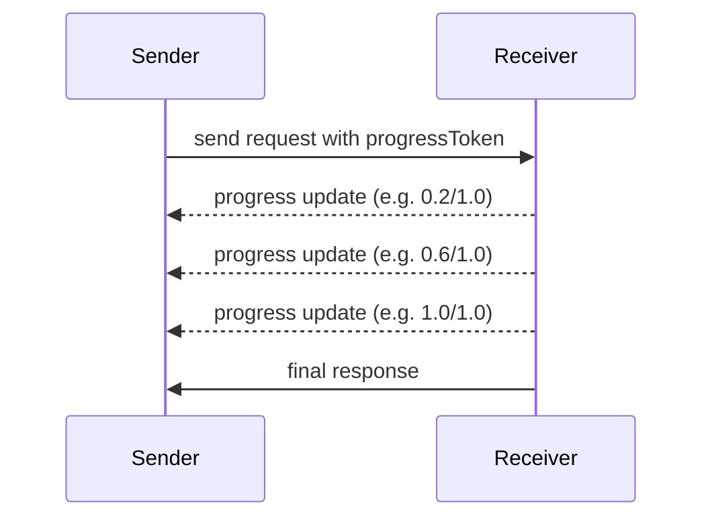

## What is MCP and Its Progress Feature?

* **MCP (Model Context Protocol)** is a simple standard that lets AI models talk to external tools or systems using structured messages—kind of like a common language for AI and apps. Think of it like giving AI “superpowers” to use tools safely and reliably. ([Wikipedia][1], [The Verge][2], [Google Cloud][3])

* MCP also supports **progress tracking**—that means during a long-running task, either side (like the server) can send updates to show how the task is going. ([Model Context Protocol][4])

---

## How Does **Progress Tracking** Work?

### 1. **Include a progress token in your request**

When you send a request and want progress updates, add a small extra field called `progressToken` to your request metadata.

* It **must** be a unique string or integer.
* It identifies your request.

```json
{
  "jsonrpc": "2.0",
  "id": 1,
  "method": "some_method",
  "params": {
    "_meta": {
      "progressToken": "abc123"
    }
  }
}
```

---

### 2. **Server sends back progress notifications**

As the server works on the request, it may send messages like this:

```json
{
  "jsonrpc": "2.0",
  "method": "notifications/progress",
  "params": {
    "progressToken": "abc123",
    "progress": 50,
    "total": 100,
    "message": "Halfway there..."
  }
}
```

These updates include:

* **progressToken** – to match your original request.
* **progress** – how much is done so far. It **must always increase** with each update (can be decimal numbers like 0.2, 0.5, 1.0).
* **total** (optional) – how much effort in total (like 100 units).
* **message** (optional) – friendly text describing what’s happening. ([Model Context Protocol][4])

---

### 3. **Finish with the final response**

Once the task is done, server should **stop sending progress updates** and send the final result as usual.

---

## Step-by-Step of the Flow



---

## Quick Example in Simple Words

Imagine you're baking a cake and your friend asks you, "Let me know how it's going."

* You say **"Here’s my plan: I’ll send you updates."**
* Then you send texts:

  * “Step 1 done—mixing ingredients (20%)”
  * “Step 2 done—baking (60%)”
  * “Cake is out—cooling now (100%)”
* Finally: “Cake's ready!”

In MCP terms:

1. Your friend is the **sender**, includes a progress token like `"cakeJob1"`.
2. You send progress notifications with increasing percentages and messages.
3. When done, you send your final message.

---

## Why it's Helpful

* **Keeps you informed** during long tasks.
* **Optional and flexible**—notifications are allowed but not required. ([Model Context Protocol][4])
* You can control how often notifications come (to avoid too many).
* Notifications **must** stop once the task is complete. ([Model Context Protocol][4])

---

## Summary Table for Easy Reference

| Step       | Action                                  | Easy Explanation          |
| ---------- | --------------------------------------- | ------------------------- |
| 1. Request | Add `progressToken` in the request      | “Let me follow this job.” |
| 2. Notify  | Server sends `progress`, `total`, `msg` | “20% done... 60% done...” |
| 3. Finish  | Server returns final result             | “All done!”               |


[1]: https://en.wikipedia.org/wiki/Model_Context_Protocol?utm_source=chatgpt.com "Model Context Protocol"
[2]: https://www.theverge.com/2024/11/25/24305774/anthropic-model-context-protocol-data-sources?utm_source=chatgpt.com "Anthropic launches tool to connect AI systems directly to datasets"
[3]: https://cloud.google.com/discover/what-is-model-context-protocol?utm_source=chatgpt.com "What is Model Context Protocol (MCP)? A guide - Google Cloud"
[4]: https://modelcontextprotocol.io/specification/2025-03-26/basic/utilities/progress?utm_source=chatgpt.com "Progress - Model Context Protocol"
